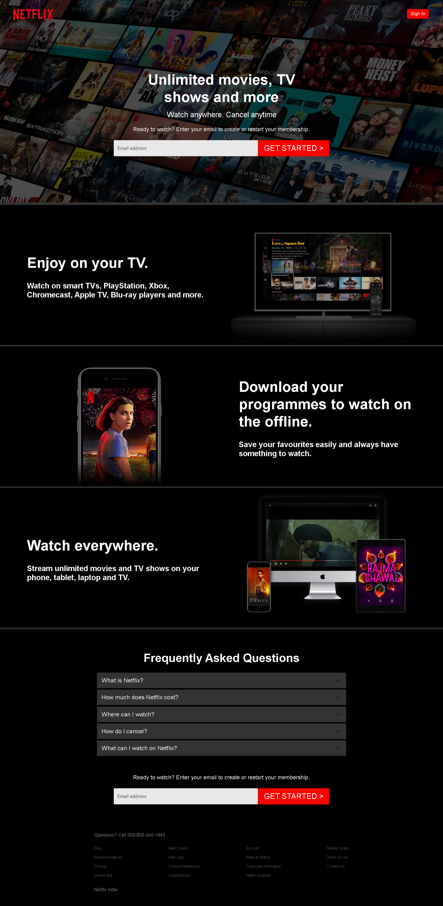

# Team Triangle

# Netflix- Clone
  

In the project directory, tried to clone Netflix.  
Netflix is a streaming service that offers a wide variety of award-winning TV shows, movies, anime, documentaries and more – on thousands of internet-connected devices.
You can watch as much as you want, whenever you want, without a single ad – all for one low monthly price. There's always something new to discover, and new TV shows and movies are added every week!
 

## Tech Stack used:

<code></code>
<code></code>
<code></code>
<code></code>
<code></code>
<code></code>
<code></code>
<code></code>
<code></code>

## Sneak peek

## <code>Landing Page</code>

## <code>Home Page</code>

### Installation and Setup Instructions

Clone down this repository. You will need node and npm installed globally on your machine. Installation: npm install To Run Test Suite: npm test To Start Server: npm start To Visit App: localhost:3000/

## Tech Library used:
  <ul>
  <li>React APP</li>
  <li>Axios</li>
  <li>Material UI</li>
<li>bcrypt</li>
<li>bcryptjs</li>
<li>concurrently</li>
<li>cors</li>
<li>dotenv</li>
<li>express</li>
<li>joi</li>
<li>jsonwebtoken</li>
<li>mongoose</li>
<li>razorpay</li>
<li>react-router-dom</li>
<li>request</li>
<li>uuid</li>
  <li>@fortawesome/fontawesome-svg-core</li>
    <li>@fortawesome/free-solid-svg-icons</li>
    <li>@fortawesome/react-fontawesome</li>
    <li>email-validator</li>
    <li>node-sass</li>
    <li>react</li>
    <li>react-debounce-input</li>
    <li>react-dom</li>
    <li>react-elastic-carousel</li>
    <li>react-icons</li>
    <li>react-jw-player</li>
    <li>react-modal</li>
    <li>react-redux</li>
    <li>react-router-dom</li>
    <li>react-scripts</li>
    <li>react-slick</li>
    <li>react-youtube</li>
    <li>redux</li>
    <li>redux-devtools-extension</li>
    <li>redux-thunk</li>
    <li>slick-carousel</li>
    <li>styled-components</li>
  </ul>

## Contributors

<a href="https://github.com/nishthaarya" >Nishtha</a>

 <a href="https://github.com/MahenParameshwar" >Mahen</a>

<a href="https://github.com/amal-biju">Amal</a> 

<a href="https://github.com/lsriniwas">Sriniwas</a>

### Acknowledgments

  We take all the responsiblity for every single line of code. The design inspired from Netflix

